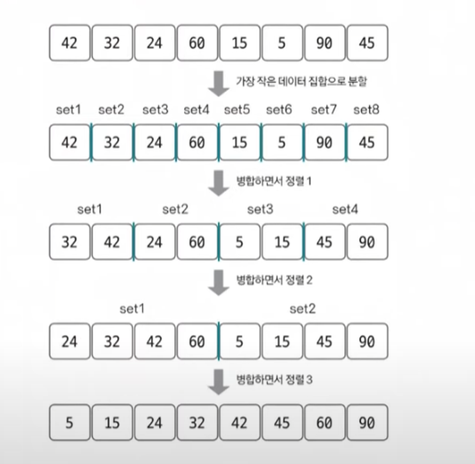
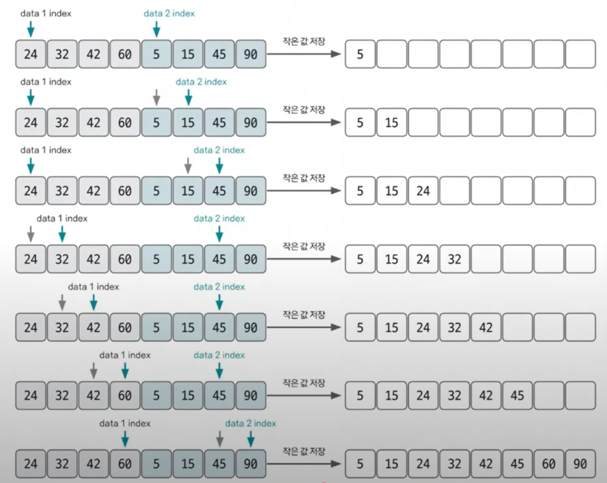

# 병합 정렬

- 분할 정복 방식을 사용해 데이터를 분할하고 분할한 집합을 정렬하며 합치는 알고리즘
- 시간 복잡도는 $O(nlogn)$
- 2개의 그룹을 병합하는 원리를 숙지(투 포인터 활용)

  

# 투 포인터 알고리즘
- 정렬된 배열이나 리스트에서 '두 개의 포인터'를 활용하여 특정 조건을 만족하는 부분 구간을 효율적으로 탐색하는 알고리즘.
- 시간복잡도는 $O(n)$