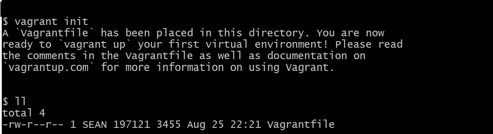

# Vagrant

- 가상화에 필요한 인스턴스 생성 및 관리 용이
- 이미지 관리 용이
- 설정 스크립트를 기반으로 특정 환경의 가상머신을 생성
    - 스크립트만으로 인스턴스의 이름, 네트워크 환경, 메모리 크기 등 설정.
    - 버전 관리 가능.
    - 여러 PC에 적용하기 수월함.(개발 환경 공유)
- Ruby로 개발 됨.
- [다운로드 사이트](https://developer.hashicorp.com/vagrant/install)

  

# Provisioning
- IT 인프라를 생성, 설정하는 프로세스
- 다양한 리소스에 대한 사용자 및 시스템 액세스를 관리하는 데 필요한 단계 포함.
- 사용자의 요구에 맞게 시스템 자원을 할당, 배치, 배포 → 필요 시 시스템을 즉시 사용할 수 있는 상태로 미리 준비.

  

# 실습환경

  

# Vagrant를 이용하여 VM 제어하기

Vagrant에서 사용하는 [명령어 확인](https://developer.hashicorp.com/vagrant/docs)

Vagrant Boxes 확인
[Discover Vagrant Boxes](https://portal.cloud.hashicorp.com/vagrant/discover)

  

## VagrantFile
- Ruby 언어로 작성된 Vagrant 설정 스크립트
- Vagrant 인스턴스로 생성 될 내용(설정) 등의 내용을 작성
- vagrant init 명령어 실행 시 기본 VagrantFile 생성

 

## Vagrant 사용
- vagrant init
    - 초기파일생성. 원하는 box로 수정(위 박스 사이트 참고)

- vagrant up
    - vagrant 인스턴스 시작
- vagrant ssh [vagrant_instance_name]
    - ssh로 인스턴스 연결
- vagrant halt
    - 종료
- vagrant suspend
    - 대기
- vagrant distory
    - box 삭제

### vagrant box 설치 시 오류 정리

> mount -t vboxsf -o uid=1000,gid=1000,_netdev vagrant /vagrant
> The error output from the command was:
> /sbin/mount.vboxsf: mounting failed with the error: No such device

- VirtualBox Guest Additions가 제대로 설치되지 않았거나, 호스트와 게스트 간 버전이 맞지 않을 때 자주 발생
- Vagrant가 VirtualBox 공유 폴더(vboxsf 파일시스템)를 마운트하려고 하는데, 게스트 OS 쪽에 그 기능을 지원하는 모듈이 없어서 생기는 문제

#### 해결방법
게스트 OS에 맞는 Guest Additions를 자동으로 설치·업데이트해준다.
> vagrant plugin install vagrant-vbguest

이미 실행중인 VM에 적용하려면
> vagrant vbguest
> vagrant reload