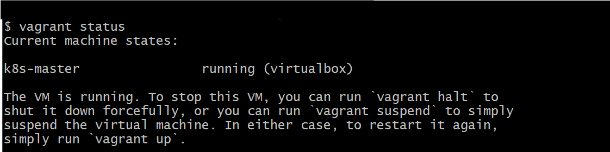

# 초기 계정 접속 정보
General User
username : vagrant
password : vagrant

Root User
username : root
password : varant

실제 셋팅 해서 사용하게 되는 경우, 쉘 스크립트에 새 계정 생성 및 패스워스 설정, root 패스워드 변경 추가 필요.

### vagrant status

### vagrant ssh [접속할 서버 이름]

  

# 가상머신에 Docker 설치

## root 계정 변경
> passwd root

## SWAP 비활성화(swap 기능 끄고, 부팅 시 자동 스왑 켜지지 않도록 설정)
> swapoff -a && sed -i '/swap/s/^/#/' /etc/fstab

COMMAND 설명

- swapoff: 현재 사용 중인 모든 스왑 영역을 비활성
    - -a 옵션: /proc/swaps에 등록된 모든 스왑 장치/파일을 끕니다.
    - 실행 후에는 물리 메모리(RAM)만 사용하게 됩니다.
- && : 앞 명령이 잘 실행되면 뒤 명령어 실행
- sed -i '/swap/s/^/#/' /etc/fstab
    - sed: 파일 내용 변환(스트림 편집기)
    - -i: 파일을 직접 수정(인플레이스)
    - '/swap/...': swap이라는 단어가 들어간 라인을 찾아서
    - s/^/#/: 해당 라인의 맨 앞(^)에 #을 추가 → 주석 처리
ㄴ

SWAP

리눅스·유닉스 계열 운영체제의 가상 메모리 공간
- RAM이 부족할 때 디스크 공간 일부를 메모리처럼 사용하는 방식
- 스왑 영역에 저장된 데이터는 다시 필요할 때 RAM으로 가져옵니다
- 장점
- RAM 부족 상황에서 프로그램이 죽는 걸 방지
- 대규모 작업 시 안정성 확보
- 단점
- 디스크 속도가 RAM보다 훨씬 느려서 성능 저하 가능
- SSD 사용 시 잦은 쓰기 작업으로 수명 단축 가능

